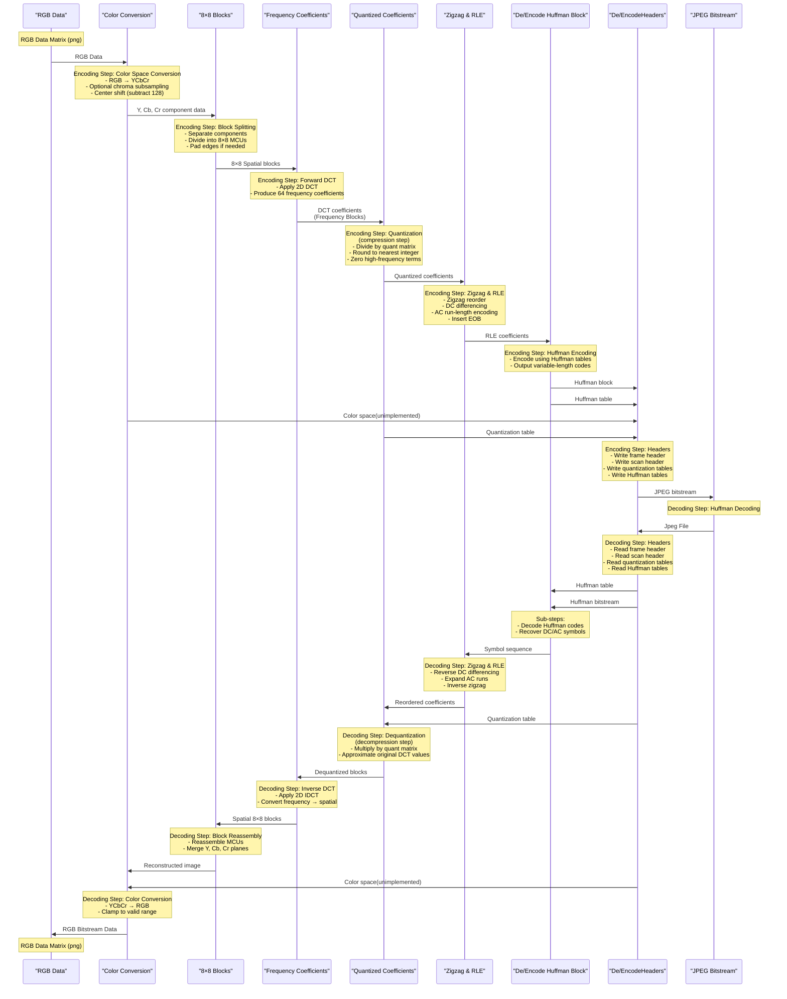

# Ollie — Pure JavaScript JPEG Codec

**Ollie** is a lightweight, dependency-free JPEG encoder and decoder written entirely in vanilla JavaScript.  
Its goal is twofold:

1. **Educational** — to clearly expose each stage of the JPEG compression pipeline.  
2. **Practical** — to provide a functional, browser-friendly JPEG codec with no external dependencies or WASM.

Whether you're exploring how JPEG works under the hood or integrating a codec into a web project, Ollie aims to be clear, approachable, and hackable.

---

## ✨ Features

### Core JPEG Codec
- **Pure JavaScript:** No native modules, no WebAssembly, no heavyweight dependencies.
- **JPEG Encoder:** Converts raw RGBA image data → JPEG binary.
- **JPEG Decoder:** Converts JPEG binary → raw RGBA image data.
- **Baseline Sequential DCT:** The most widely supported JPEG variant.
- **Progressive JPEG:** Multi-scan encoding and decoding support.

### Advanced Features
- **SPIFF Markers:** Support for APP8 SPIFF (Still Picture Interchange File Format) markers.
- **Steganography:** Embed hidden data within JPEG files using DCT coefficient modification.
- **Container Format:** Structured metadata format for storing encrypted data with versioning.
- **Reed-Solomon Error Correction:** Robust error correction for embedded data.
- **Multi-File Splitting:** Shard data across multiple JPEG files with reassembly support.

### Configurable Internals
- **Multiple IDCT Implementations:** Select between Naive, Reference, and Fast AAN (Arai-Agui-Nakajima) algorithms.
- **Huffman Decoding Strategies:** Choose between naive Map-based or optimized 16-bit LUT decoding.
- **Bit Reader Variants:** Swap between different BitReader implementations for performance tuning.
- **Quantization Methods:** Configurable quantization table selection and quality levels.

### Developer Experience
- **Modular Architecture:** Each JPEG specification step is implemented as a clean, isolated module.
- **Educational Codebase:** Designed to be readable, traceable, and easy to learn from.
- **Comprehensive Testing:** Unit and integration tests for all components.
- **Browser & Node.js:** Works in both environments with unified test infrastructure.

---

## 📁 Directory Structure

```
src/
  main.js                # Demo UI and entry point
  core/
    jpeg-encoder.js      # High-level encoder orchestrator
    jpeg-decoder.js      # High-level decoder orchestrator

    encoder/             # Encoder internals
      dct.js
      quantization.js
      huffman.js
      ... (color, RLE, zigzag)

    decoder/             # Decoder internals
      parser.js
      idct.js
      huffman.js
      upsampling.js
      ...

  utils/
    bit-reader.js
    bit-writer.js

test/                    # Unit + integration tests
```

---

## 🖼️ How JPEG Works (Overview)

JPEG is a **lossy**, block-based image compression format.  
Ollie implements the “baseline sequential DCT” JPEG, the most widely supported variant.

Below are the major stages, explained in a way that mirrors the project’s structure.


---

## 🔵 JPEG Encoding Pipeline

### 1. **Color Space Conversion (RGB → YCbCr)**  
JPEG separates brightness from color.  
- **Y** = luminance (perceived brightness — the most important part)  
- **Cb/Cr** = chroma (blue/red color difference)

This separation allows JPEG to compress color more aggressively than luminance, taking advantage of human visual sensitivity.

---

### 2. **(Optional) Chroma Subsampling**  

Most JPEGs store color at reduced resolution (e.g., **4:2:0**):  
- Y: full resolution  
- Cb/Cr: half resolution horizontally & vertically  
This dramatically reduces file size with minimal perceived quality loss.
#### ```❗ Important Note```

##### ```    Ollie does not currently support chroma subsampling,  and decoding naively expects 4:4:4 chroma subsampling. ```


---

### 3. **8×8 Block Splitting**  
Each Y/Cb/Cr component is divided into **8×8 blocks**.  
All further processing occurs on these blocks individually.

---

### 4. **Forward DCT (Spatial → Frequency Domain)**  
The **Discrete Cosine Transform** converts pixel values into frequency coefficients.  
- Upper-left coefficient = **DC term** = block's average brightness  
- Remaining 63 = **AC terms**, describing increasing spatial frequencies

Low frequencies carry most perceptual energy; high frequencies can be compressed more heavily.

---

### 5. **Quantization (Lossy Step)**  
Each frequency coefficient is divided by an entry in a **quantization table** and rounded.  
- Low frequencies: small divisors → preserved detail  
- High frequencies: larger divisors → values shrink to zero

This is where JPEG achieves most of its compression.

---

### 6. **Zigzag Ordering**  
The 8×8 coefficients are read using a zigzag pattern that pushes low-frequency values first and groups the long tail of zeros at the end.

```
0  1  5  6 14 15 ...
2  4  7 13 ...
3  8 12 ...
9 11 ...
10 ...
```

This arrangement makes run-length encoding extremely effective.

---

### 7. **Entropy Coding (Huffman + RLE)**  
Two key tricks happen here:

1. **DC differential coding**  
   - Each block’s DC value is stored as a delta from the previous block.

2. **AC run-length encoding (RLE)**  
   - Long sequences of zeros become compact tokens.

Finally, everything is Huffman-encoded into the final compressed bitstream.

---

## 🔶 JPEG Decoding Pipeline

Decoding reverses the above steps:

### 1. **Parsing JPEG Markers**  
The decoder reads the structured segments of a JPEG file:  
`SOI`, `DQT`, `DHT`, `SOF0`, `SOS`, etc.  
These define quantization tables, Huffman tables, sampling structure, and image dimensions.

---

### 2. **Entropy Decoding**  
The compressed bitstream is decoded using:  
- DC differential decoding  
- AC run-length expansion  
- Huffman tables from the file

Result → quantized frequency coefficients.

---

### 3. **Inverse Zigzag**  
Re-create the 8×8 coefficient matrix for each block.

---

### 4. **Dequantization**  
Multiply each coefficient by the value from the corresponding quantization table.

---

### 5. **Inverse DCT (IDCT)**  
Transforms each dequantized 8×8 block back into spatial pixel values.  
Ollie exposes multiple implementations to compare performance and accuracy.

---

### 6. **Chroma Upsampling**  
If the JPEG uses chroma subsampling (e.g., 4:2:0), the Cb and Cr planes are upscaled to full resolution.

---

### 7. **Color Conversion (YCbCr → RGB)**  
The final image is reconstructed by converting each pixel back to RGB.

---

### 8. **Block Assembly**  
All 8×8 blocks are stitched back together to form the output image.

---

## ▶️ Usage

Open **`index.html`** in a browser to try the interactive demo:

- **Encode** an uploaded image as JPEG  
- **Decode** any JPEG file into raw pixel data  
- Inspect intermediate stages if you're exploring how JPEG works

---

## 🧪 Testing

Ollie includes a comprehensive test suite covering all components:

### Browser Testing
Open **`test.html`** in a browser to run the full test suite with a visual interface.

### Node.js Testing
Run tests from the command line:
```bash
node test/runner.js
```

### Test Coverage
- **Encoder Tests:** Color space conversion, DCT, quantization, Huffman coding, progressive encoding, SPIFF generation
- **Decoder Tests:** Frame/scan parsing, Huffman decoding, IDCT algorithms, progressive decoding, SPIFF parsing
- **Utility Tests:** Bit readers/writers, marker parsing
- **Steganography Tests:** Data embedding, container format, chunk management
- **Error Correction Tests:** Reed-Solomon integration
- **Integration Tests:** Roundtrip encoding/decoding, steganography roundtrip, format detection
- **UI Tests:** User interface interactions


---
